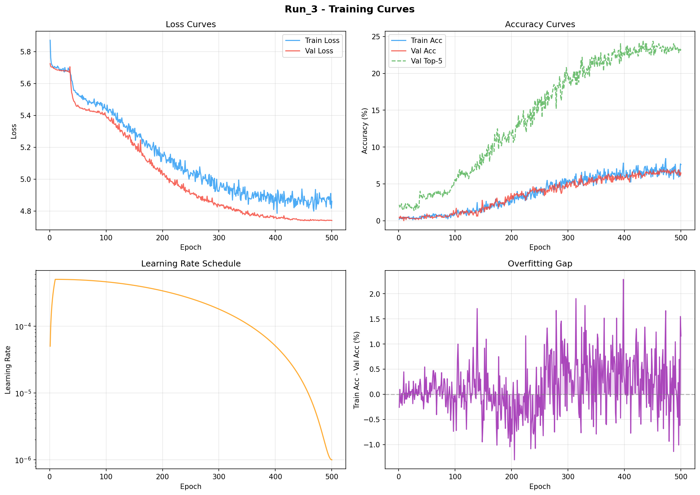

# Run_3 - Training Report

**Generated:** Auto-generated by analyze_results.py  
**Model:** GestureTransformer (1,661,868 parameters)  
**Classes:** 300  
**Total Epochs:** 500

---

## Results Summary

| Metric | Value |
|---|---|
| **Best Val Accuracy** | 6.78% |
| **Best Epoch** | 464 |
| **Test Top-1 Accuracy** | 5.09% |
| **Test Top-5 Accuracy** | 20.57% |
| **Test Loss** | 4.8468 |
| **Peak Train Accuracy** | 8.44% |
| **Final Train Loss** | 4.8608 |
| **Train-Val Gap** | 1.16% |

## Training Progression

| Epoch | Train Loss | Train Acc | Val Acc | Val Top-5 |
|---|---|---|---|---|
| 1 | 5.8709 | 0.20% | 0.46% | 2.16% |
| 10 | 5.6989 | 0.28% | 0.46% | 2.00% |
| 25 | 5.6786 | 0.12% | 0.31% | 1.85% |
| 50 | 5.5367 | 0.77% | 0.92% | 3.08% |
| 100 | 5.4397 | 1.06% | 1.08% | 5.39% |
| 150 | 5.2968 | 1.58% | 1.69% | 7.86% |
| 200 | 5.1522 | 2.44% | 2.93% | 11.56% |
| 250 | 5.0420 | 4.10% | 4.16% | 15.87% |
| 300 | 4.9226 | 5.28% | 4.62% | 19.26% |
| 350 | 4.9239 | 4.91% | 5.70% | 21.26% |
| 400 | 4.8621 | 6.13% | 5.86% | 22.34% |
| 450 | 4.8374 | 6.01% | 6.32% | 24.35% |
| 500 | 4.8608 | 7.63% | 6.47% | 23.27% |
| **464 (best)** | **4.8872** | **6.62%** | **6.93%** | **23.57%** |

## Analysis

- **Overfitting:** OK Good (train-val gap = 1.2%)
- **Convergence:** May need more epochs
- **Learning Rate:** Started at 0.000050, ended at 0.00000100

## Training Curves

