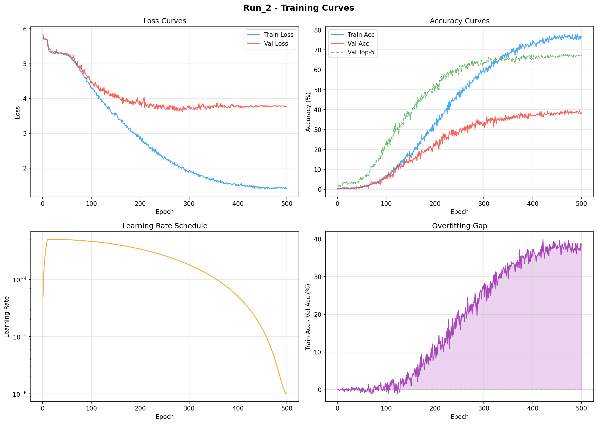

# Run_2 - Training Report

**Generated:** Auto-generated by analyze_results.py  
**Model:** GestureTransformer (3,455,532 parameters)  
**Classes:** 300  
**Total Epochs:** 500

---

## Results Summary

| Metric | Value |
|---|---|
| **Best Val Accuracy** | 39.60% |
| **Best Epoch** | 471 |
| **Test Top-1 Accuracy** | 30.38% |
| **Test Top-5 Accuracy** | 60.19% |
| **Test Loss** | 4.2508 |
| **Peak Train Accuracy** | 77.72% |
| **Final Train Loss** | 1.4217 |
| **Train-Val Gap** | 38.61% |

## Training Progression

| Epoch | Train Loss | Train Acc | Val Acc | Val Top-5 |
|---|---|---|---|---|
| 1 | 5.8390 | 0.41% | 0.31% | 1.69% |
| 10 | 5.6717 | 0.61% | 0.31% | 2.16% |
| 25 | 5.3493 | 0.57% | 0.62% | 3.54% |
| 50 | 5.2557 | 1.10% | 0.77% | 5.08% |
| 100 | 4.2864 | 7.06% | 5.55% | 22.65% |
| 150 | 3.5834 | 17.13% | 14.02% | 34.98% |
| 200 | 2.9031 | 32.83% | 22.19% | 51.77% |
| 250 | 2.3289 | 46.06% | 28.81% | 61.17% |
| 300 | 1.9185 | 59.01% | 32.36% | 63.02% |
| 350 | 1.6954 | 66.36% | 36.83% | 66.56% |
| 400 | 1.4980 | 74.59% | 37.29% | 65.49% |
| 450 | 1.4453 | 76.06% | 38.67% | 66.26% |
| 500 | 1.4217 | 76.83% | 38.21% | 67.03% |
| **471 (best)** | **1.4274** | **76.30%** | **39.60%** | **67.64%** |

## Analysis

- **Overfitting:** !! Significant (train-val gap = 38.6%)
- **Convergence:** Model converged
- **Learning Rate:** Started at 0.000050, ended at 0.00000100

## Training Curves

